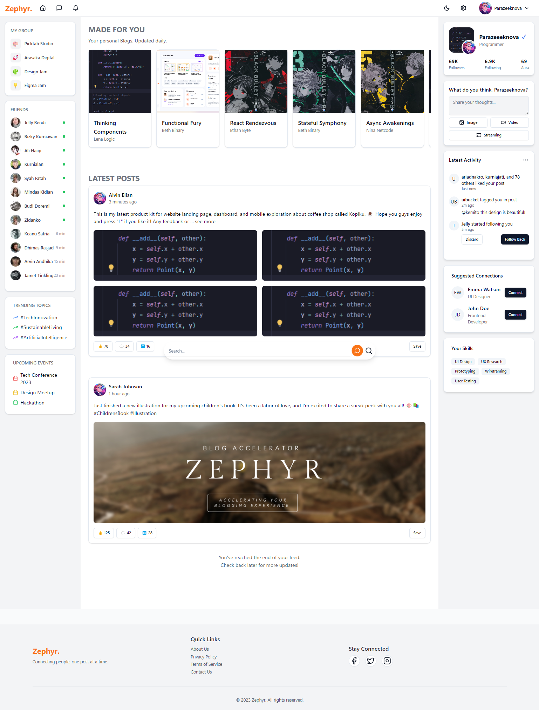
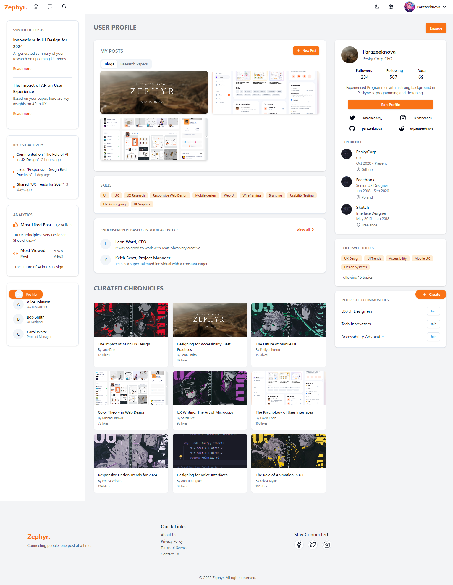

<div align="center">

  <a href="https://github.com/parazeeknova/zephyr">
    
  </a>
</div>

<br>

<div align="center">
  <a href="https://github.com//parazeeknova/zephyr#-development-setup-for-contributers"><kbd> <br> Development <br> </kbd></a>&ensp;&ensp;
  <a href="https://github.com//parazeeknova/zephyr#-preview"><kbd> <br> Preview <br> </kbd></a>&ensp;&ensp;
  <a href="https://github.com/parazeeknova/zephyr/wiki"><kbd> <br> Wiki <br> </kbd></a>&ensp;&ensp;
</div>

<br>

> [!IMPORTANT] > **Note:** This is a project proposal created for overview (current). The content and features described below are purely speculative and do not represent an actual product or service to be implemented.

#### _<div align="left"><sub>// Project Overview</sub></div>_

<p align="center">
<strong>Zephyr</strong> is an Blog/Search Accelerator & social media platform designed to revamp how blog and research writers create, share, and collaborate on content. With AI-powered content summarization, dynamic profile generation, and advanced search functionality, Zephyr aims to streamline the content creation process and enhance user engagement. Whether you're a seasoned blogger, an academic researcher, or a content enthusiast, Zephyr provides the tools and features to elevate your writing experience.
</p>

<div align="center">
	<a href="https://github.com/parazeeknova/zephyr/stargazers">
		</a>
	<a href="https://github.com/parazeeknova/zephyr/issues">
		</a>
    <a href="https://github.com/parazeeknova/zephyr/releases">
    </a>
	</a>
</div>

<br>

#### _<div align="left"><sub>// Development Setup (For Contributers)</sub></div>_

###### _<div align="right"><sub>// Prerequisites</sub></div>_

- [Bun](https://bun.sh/) - Blazing fast task runner for modern web development.
- [NodeJS](https://nodejs.org/) - JavaScript runtime built on Chrome's V8 JavaScript engine.
- [Git](https://git-scm.com/) - git is git

```bash
git clone https://github.com/parazeeknova/zephyr.git # Clone the repository
cd zephyr # Change directory to the project folder
bun install OR bun i # Install dependencies
bun dev OR bun d # Start the development server
```

###### _<div align="right"><sub>// VSCode Extentions</sub></div>_

- [x] **ESLint**: For linting and code formatting.
- [x] **Prettier**: For code formatting.
- [ ] **tailwind CSS IntelliSense**: For Tailwind CSS support. (Optional)

<br>

#### _<div align="left"><sub>// Preview</sub></div>_

| Home                                         | Profile                                           |
| -------------------------------------------- | ------------------------------------------------- |
|  |  |

<br>

<div align="right">
  <a href="#-project-overview"><kbd> <br> 🡅 <br> </kbd></a>
</div>
