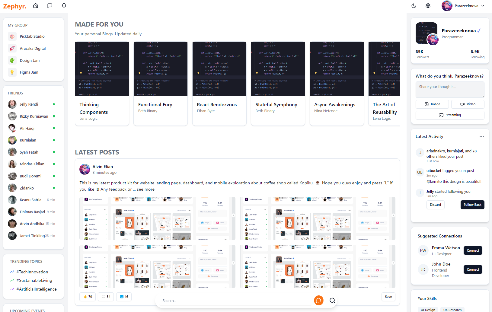

<div align="center">

  <a href="https://github.com/parazeeknova/zephyr">
    
  </a>
</div>

<br>

> [!IMPORTANT] > **Note:** This is a fictional project proposal created for overview (current). The content and features described below are purely speculative and do not represent an actual product or service to be implemented.

#### _<div align="left"><sub>// Project Overview</sub></div>_

<p align="center">
<strong>Zephyr</strong> is an Blog/Search Accelerator & social media platform designed to revamp how blog and research writers create, share, and collaborate on content. With AI-powered content summarization, dynamic profile generation, and advanced search functionality, Zephyr aims to streamline the content creation process and enhance user engagement. Whether you're a seasoned blogger, an academic researcher, or a content enthusiast, Zephyr provides the tools and features to elevate your writing experience.
</p>

<br>

#### _<div align="left"><sub>// Core Features (Expected)</sub></div>_

- [ ] **AI-Powered Content Summarization**: Automatically generate highlights and summaries from long-form content.
- [ ] **Dynamic Profile Generation**: Create and update user profiles based on their content and interactions.
- [ ] **Automatic Tagging and Categorization**: Use AI to analyze content and assign relevant tags and categories.
- [ ] **Collaborative Editing**: Implement GitHub-like version control and collaboration features for text content.
- [ ] **Advanced Search Functionality**: Enable searching based on topics, tags, and content summaries.
- [ ] **Content Recommendation Engine**: Suggest relevant posts to users based on their preferences and behavior.
- [ ] **Citation and Reference Management**: Integrate tools for managing and tracking academic sources.
- [ ] **Interactive Visualizations**: Allow embedding of charts, graphs, and data visualizations within posts.
- [ ] **Peer Review System**: Implement a structured review process for academic or scientific content.
- [ ] **Customizable Content Feeds**: Enable users to create personalized feeds based on their interests.
- [ ] **In-line Annotations and Discussions**: Foster focused conversations on specific parts of a post.
- [ ] **Content Analytics**: Provide authors with detailed metrics on their posts' performance.
- [ ] **Multi-language Support**: Implement automatic translation for global accessibility.

<br>

#### _<div align="left"><sub>// Development Setup (For Contributers)</sub></div>_

###### _<div align="right"><sub>// Prerequisites</sub></div>_

- [Bun](https://bun.sh/) - Blazing fast task runner for modern web development.
- [NodeJS](https://nodejs.org/) - JavaScript runtime built on Chrome's V8 JavaScript engine.
- [Git](https://git-scm.com/) - git is git

```bash
git clone https://github.com/parazeeknova/zephyr.git # Clone the repository
cd zephyr # Change directory to the project folder
bun install OR bun i # Install dependencies
bun dev OR bun d # Start the development server
```

###### _<div align="right"><sub>// VSCode Extentions</sub></div>_

- [x] **ESLint**: For linting and code formatting.
- [x] **Prettier**: For code formatting.
- [ ] **tailwind CSS IntelliSense**: For Tailwind CSS support.

<br>

#### _<div align="left"><sub>// Preview</sub></div>_

<div align="center">

  <a href="https://github.com/parazeeknova/zephyr">
    
  </a>
</div>

<br>

<div align="right">
  <a href="#-project-overview"><kbd> <br> 🡅 <br> </kbd></a>
</div>
